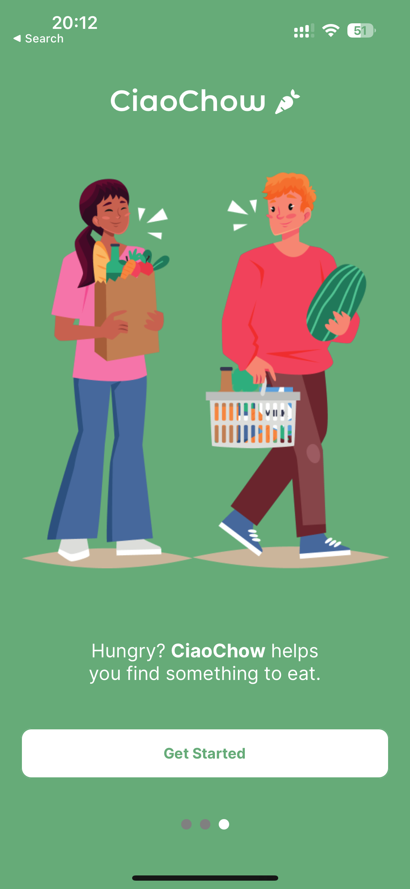

# CiaoChow React Native Application 👋🏾

## About

This repository contains a React Native application that aims to simplify the process of finding and exploring your favorite food options. With this app, users can conveniently log in, register, and discover a wide range of delicious culinary delights.

## Screenshots

## Expo QR Code

